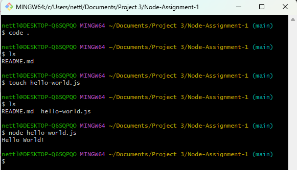

# Node-Assignment-1

## Objective

The purpose of this assignment is to establish a foundational understanding of Node.js setup and basic terminal commands. You will install Node.js, verify its installation, and execute a simple "Hello, World!" program. This task aims to introduce you to command-line operations and the importance of Node.js in backend development, as well as to practice documenting and sharing your work through GitHub.

## Steps

- Installed node.js from <a href='nodejs.org/en/'>Node JS</a>.
- Created a new repository and initialized it with a README.md file.
- Opened VS code and cloned repository. In the file that contained my repository, I opened git bash.
- Created new file named hello-world.js using the touch command.
- In VS code js file, added console.log('Hello World!).
- In the git terminal, coded node hello-world.js to display console's message.  
  
